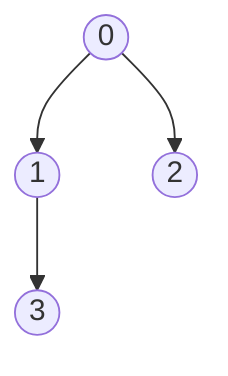
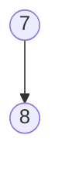
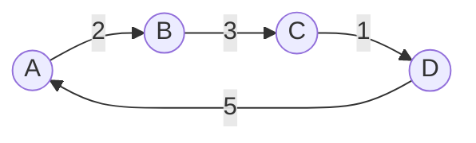
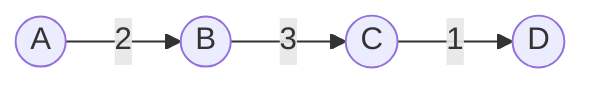

# Graph Data Structure

## What is it?

A set of connected data is called a graph. Yes, that's it.

Example: Facebook. You have profile details, dp, location, work info etc. for the Facebook database you are collection of data or a node [ You ] similarly your friends in Facebook are also nodes [ Friend A ] and [ Friend B ].

So if you and your Friend A and Friend B are connected then in the database your are represented as

`[ You ] : [ Friend A , Friend B ]`

These are nothing but addresses of nodes. This can also be represented as a JavaScript object.

```
const friendGraph = {
you : [ paul , john ],
paul : [ john , walker, you ],
john : [ you, walker ]
}

```

So, if I want to find who are your friends then I need to just query

```
const graph = friendGraph[you] // [paul , john]
```

If I want Paul and John's friends I just need to loop through the collection and use the Paul and John as key to find their connection.

That's it. This is a basic graph or a directed graph.

The implementation of a basic undirected graph is in this directory [here](https://github.com/sagars01/DSA_Zero_To_Hero/blob/master/src/Graph/Graph.js)

# Types of Graphs

There are 3 types of graphs that we are interested in

- **Directed**
- **Undirected**
- **Cyclic**

You can learn those concepts from anywhere on the internet, they are pretty easy and available everywhere. So, won't waste any time.

But, we should also know about some algorithms to solve the graph problems.
Let's look into those

### Disjoint Sets or Union Find

#### What are they?

See this below graph carefully

Graph A



Graph B



If I ask you if Graph A and B are connected you'd say no its not. Because it's easy for us humans to tell that, but that's not the case for computers.

We need a way for a program to tell whether these graphs are connected or not.

To answer this question we need a special array based data structure called **disjoint sets** or an algorithm called **union find**

**Before moving forward**, I'd urge you to revisit Stacks and Queues chapter once.
This will bring the foundation to the problems that we are going to do.
Graphs are heavily based on stacks on queue and if you are confident with Stacks and Queues you can skip this step.

# MINIMUM SPANNING TREES (MST)

This is a very important concept of a Graph Data Structures. To get started we first have to understand why, when and how this is required and implemented.

## What is a MST?

A subset of a **weighted graph** is called a Minimum Spanning Tree.

What does that mean? It means when you have a complete graph **G$1$** with **V - vertices** and **E - edges** and you create another graph from the same graph with **V - vertices** and **(E - 1) edges** you have created a subset of the main Graph **G$2$**

**Example**

**G$1$**



**V = 4 , E = 4**

**G$2$**



**V = 4 , E = 3**

Now if you notice, we have a tree because there's **NO CYCLE** in the graph.

**G$2$** is a **MST** of **G$1$**.
